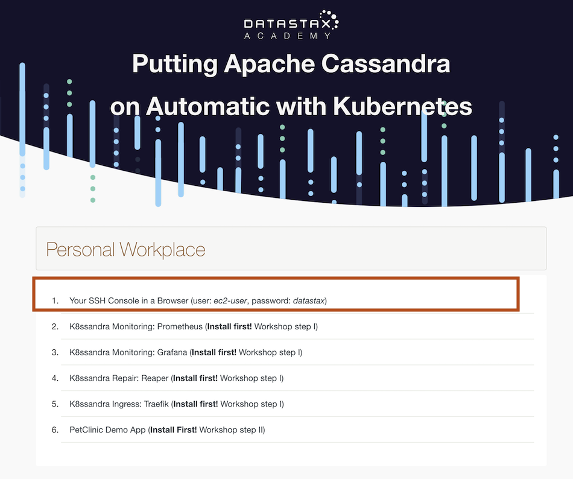
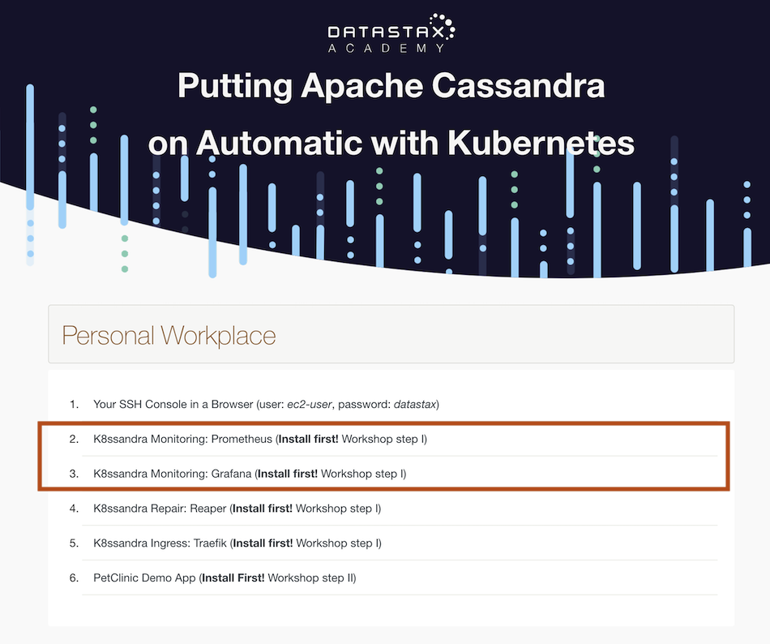
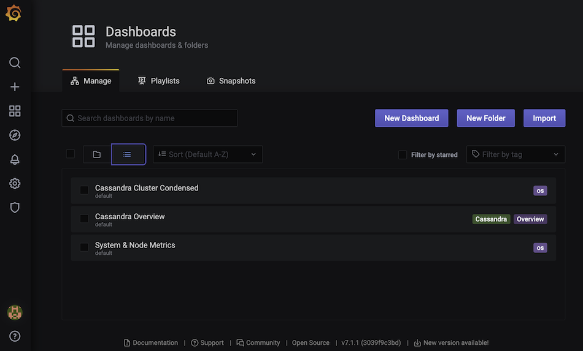
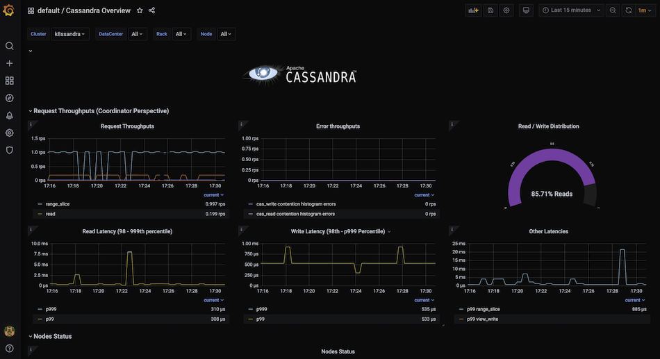
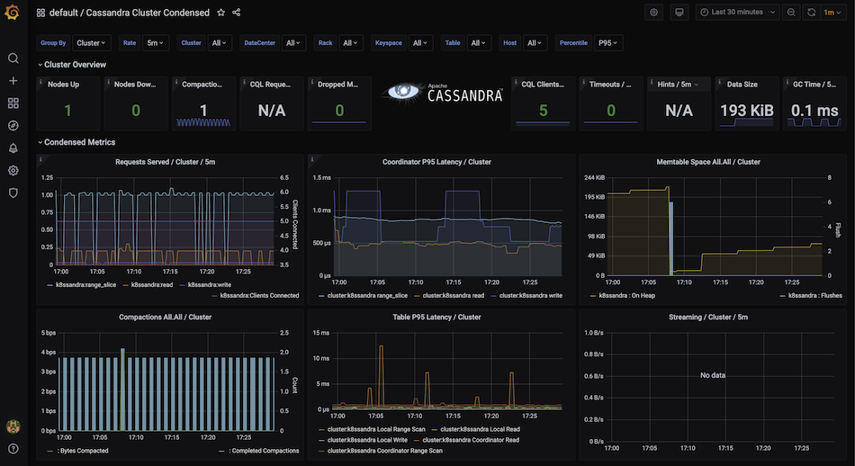
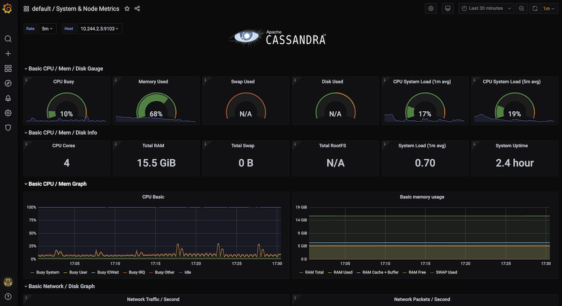
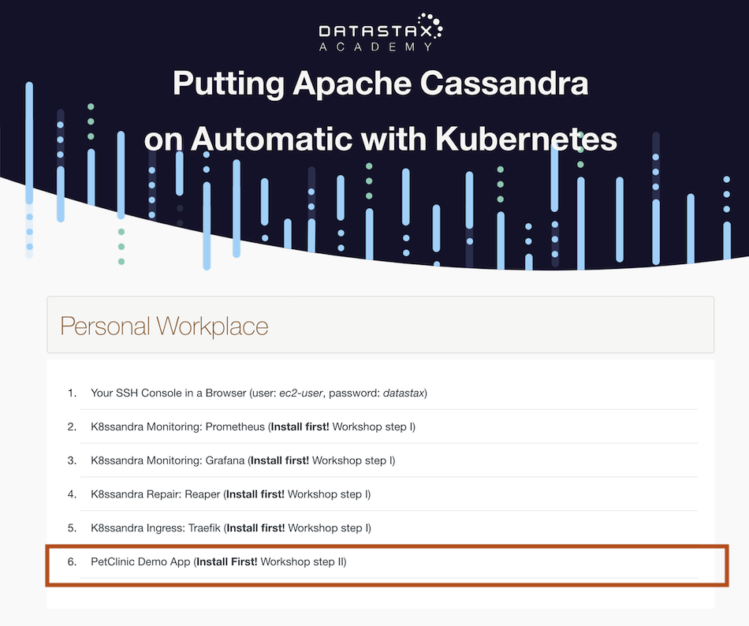

# KubeCon 2020

##  Putting Apache Cassandra on Automatic with Kubernetes™
In this repository, you'll find everything for the Cassandra Kubernetes Workshop:
Feel free to bookmark this page for future reference!


## Before starting

To follow along with the hands-on exercises during the workshop, there 2 possibilities

```diff
+ PROVIDED CLOUD INSTANCES
```

**KubeCon attendees can request a training cloud instance** using [this link](https://kubecon2020.datastaxtraining.com/).

Notice that training cloud instances will be available only during the workshop and will be terminated **24 hours later**. If you are in our workshop we recommend using the provided cloud instance, you can relax as we have you covered: prerequisites are installed already.

**⚡ IMPORTANT NOTE:**
Everywhere in this repo you see `<YOURADDRESS>` replace with the URL for the instance you were given.  

```diff
+ LOCALLY
```
If you are doing this on your own using **your own computer** or your own cloud node, please check the requirements and install the missing tools as explained [Here](https://github.com/DataStax-Academy/kubecon2020/blob/main/setup_local.md). You need to have a docker-ready machine with at least a 4-core + 8 GB RAM.

## Table of content and resources

* [Workshop On YouTube](https://www.youtube.com/watch?v=DI1bJ1tggmk)
* [Presentation](https://github.com/DataStax-Academy/kubecon2020/blob/main/November%20KubeCon%20Cassandra%20Kubernetes%20Workshop.pdf)
* [Discord chat](https://bit.ly/cassandra-workshop)
* [Q&A: community.datastax.com](https://community.datastax.com)

| Title  | Description
|---|---|
| **1 - Setting Up and Monitoring Cassandra** | [Instructions](#1-Setting-up-and-Monitoring-Cassandra)  |
| **2 - Working with Data** | [Instructions](#2-Working-with-data)  |
| **3 - Scaling Up and Down** | [Instructions](#3-Scaling-up-and-down)  |
| **4 - Running Repairs** | [Instructions](#4-Running-repairs)  |
| **5 - Resources** | [Instructions](#5-Resources)  |

## 1. Setting Up and Monitoring Cassandra

First things first.  Helm [documentation](https://helm.sh/docs/) is kind of like a high powered package manager for Kubernetes. In order to use the packages for todays workshop we will need to first add the correct repositories for helm to use.

We will pull recipies from [https://helm.k8ssandra.io/](https://helm.k8ssandra.io/) where you can find all the documentation.

**✅ Step 1a:Open your image and select the first link to go the shell** 

*Credentials to use the shell*

```yaml
Username: ec2-user
password: datastax
```



**✅ Step 1b: Add the repository to `Helm`** 

```bash
helm repo add k8ssandra https://helm.k8ssandra.io/
```

*📃output*
```bash
ec2-user@ip-172-31-5-5:~/kubernetes-workshop-online> helm repo add k8ssandra https://helm.k8ssandra.io/
"k8ssandra" has been added to your repositories      
```

**✅ Step 1c: Update `helm`** 

```bash
helm repo update
```

*📃output*
```
ec2-user@ip-172-31-5-5:~/kubernetes-workshop-online> helm repo update
Hang tight while we grab the latest from your chart repositories...                                                                                              
...Successfully got an update from the "k8ssandra" chart repository                                                                                              
Update Complete. ⎈Happy Helming!⎈                    
```

**✅ Step 1d: Add the repository to `Traefik`(leveraging Ingress)** 

In Kubernetes, network ports and services are most often handled by an Ingress controller. 

For today's lab, the K8ssandra side of things will be using Traefik.  Let's install that now.

```bash
helm repo add traefik https://helm.traefik.io/traefik
```

*📃output*
```bash
ec2-user@ip-172-31-5-5:~/kubernetes-workshop-online> helm repo add traefik https://helm.traefik.io/traefik
"traefik" has been added to your repositories  
```

**✅ Step 1e: Update Helm as before**

```bash
helm repo update
```

>*📃output*
```bash
ec2-user@ip-172-31-5-5:~/kubernetes-workshop-online> helm repo update
Hang tight while we grab the latest from your chart repositories...                                                                                              
...Successfully got an update from the "k8ssandra" chart repository                                                                                              
...Successfully got an update from the "traefik" chart repository                                                                                                
Update Complete. ⎈Happy Helming!⎈                                                                                                                                
ec2-user@ip-172-31-5-5:
```

**✅ Step 1f: Install `traefik` with following configuration [traefik.values.yaml](traefik.values.yaml)**

```bash
helm install traefik traefik/traefik --create-namespace -f traefik.values.yaml
```

>*📃output*
```bash
ec2-user@ip-172-31-5-5:~/kubernetes-workshop-online> helm install traefik traefik/traefik --create-namespace -f traefik.values.yaml
NAME: traefik                                                                                                                                                    
LAST DEPLOYED: Tue Nov 17 15:00:53 2020                                                                                                                          
NAMESPACE: default                                                                                                                                               
STATUS: deployed                                                                                                                                                 
REVISION: 1                                                                                                                                                      
TEST SUITE: None    
```

**✅ Step 1g: Use Helm to Install K8ssandra**

Lets install our Cassandra by running a helm install of K8ssandra. The long install command will be shortened down post release candidate as it will no longer need the ingress config specified. Start tools installation. It can take about 30s without log to install.

```bash
helm install k8ssandra-tools k8ssandra/k8ssandra
```

>*📃output*
```bash
ec2-user@ip-172-31-5-5:~/kubernetes-workshop-online> helm install k8ssandra-tools k8ssandra/k8ssandra
NAME: k8ssandra-tools                                                                                                                                
LAST DEPLOYED: Tue Nov 17 15:01:22 2020                                                                                                              
NAMESPACE: default                                                                                                                                   
STATUS: deployed                                                                                                                                     
REVISION: 1                                                                                                                                          
TEST SUITE: None 
```

**✅ Step 1h: Install a k8ssandra cluster**

```
helm install demo k8ssandra/k8ssandra-cluster -f demo-values.yaml
```

>*📃output*
```
ec2-user@ip-172-31-5-5:~/kubernetes-workshop-online> helm install k8ssandra-cluster-a k8ssandra/k8ssandra-cluster --set ingress.traefik.enabled=true --set in
gress.traefik.repair.host=repair.${ADDRESS} --set ingress.traefik.monitoring.grafana.host=grafana.${ADDRESS} --set ingress.traefik.monitoring.prometheus.host
=prometheus.${ADDRESS}                                                                                                                                       
NAME: k8ssandra-cluster-a                                                                                                                                    
LAST DEPLOYED: Tue Nov 17 15:04:56 2020                                                                                                                      
NAMESPACE: default                                                                                                                                           
STATUS: deployed                                                                                                                                             
REVISION: 1                                                                                                                                                  
TEST SUITE: None  
```

If you are using your own instances then replace `${ADDRESS}` with `127.0.0.1`

Verify everything is up running.  We need to wait till everything has running or completed status before moving on. It may need up to **3 minutes** 

```bash
watch kubectl get pods
```

>*📃output*
```
Every 2.0s: kubectl get pods                                                                     ip-172-31-9-15.eu-central-1.compute.internal: Tue Nov 17 14:20:55 2020
NAME                                                              READY   STATUS      RESTARTS   AGE                                                                   
cass-operator-cd9b57568-2fck2                                     1/1     Running     0          4m27s                                                                 
grafana-deployment-cfc94cf66-j8mw5                                1/1     Running     0          116s                                                                  
k8ssandra-cluster-a-grafana-operator-k8ssandra-6466cf94c9-vv6vl   1/1     Running     0          3m38s                                                                 
k8ssandra-cluster-a-reaper-k8ssandra-59cb88b674-wmb74             1/1     Running     0          75s                                                                   
k8ssandra-cluster-a-reaper-k8ssandra-schema-gsl64                 0/1     Completed   4          3m31s                                                                 
k8ssandra-cluster-a-reaper-operator-k8ssandra-56cc9bf47c-9ghsl    1/1     Running     0          3m38s                                                                 
k8ssandra-dc1-default-sts-0                                       2/2     Running     0          3m36s                                                                 
k8ssandra-tools-kube-prome-operator-6d556b76f8-5h54b              1/1     Running     0          4m27s                                                                 
prometheus-k8ssandra-cluster-a-prometheus-k8ssandra-0             2/2     Running     1          3m38s                                                                 
traefik-7877ff76c9-hpb97                                          1/1     Running     0          5m5s     
```

Notice that `reaper-k8ssandra-schema` will error out the first time but will recover. This is a known "issue", in the current pre-release.

To exit watch use `Ctrl + C`

From this command we will be able to see the pods as they come online.  Notice the steps as they complete. 

**✅ Step 1i: Monitor your system**

Modern applications and systems require that you can monitor them. K8ssandra is no different and to that end provides us with built-in Grafana and Prometheus.

To find the UI for Grafana and Prometheus use the links page in your instance and click on the corresponding Grafana and Prometheus. 

If running on a local kind cluster navigate to `prometheus.localhost:8080` and `grafana.localhost:8080` 

*For Grafana the credentials are:*
```yaml
username: admin
password: secret
```



Locate the panel on the left and pick `Dashboard > Manage`. Then click the ellipsis to show the available dashboards


Cassandra Overview


Cassandra Cluster Condenses


Cassandra Node Metrics


## 2. Working with Data

**✅ Step 2a: Deploy the PetClinic app by applying the manifest.**

```
kubectl apply -f petclinic.yaml
```

>*📃output*
```
ec2-user@ip-172-31-5-5:~/kubernetes-workshop-online> kubectl apply -f petclinic.yaml
deployment.apps/petclinic-backend created                                                                                                   
service/petclinic-backend created                                                                                                           
deployment.apps/petclinic-frontend created                                                                                                  
service/petclinic-frontend created                                                                                                          
ingress.networking.k8s.io/petclinic-ingress created 
```
We can watch our app come online with the same command we used before. Just like last time use _Ctrl + C_ to exit the watch.

```
watch kubectl get pods
```

>*📃output*
```
Every 2.0s: kubectl get pods                                           ip-172-31-5-5.eu-central-1.compute.internal: Tue Nov 17 15:28:10 2020
                                                                                                                                            
NAME                                                              READY   STATUS      RESTARTS   AGE                                        
cass-operator-cd9b57568-hcqc6                                     1/1     Running     0          26m                                        
grafana-deployment-cfc94cf66-n7jk4                                1/1     Running     0          21m                                        
k8ssandra-cluster-a-grafana-operator-k8ssandra-6466cf94c9-skzrs   1/1     Running     0          23m                                        
k8ssandra-cluster-a-reaper-k8ssandra-59cb88b674-lh6cx             1/1     Running     0          20m                                        
k8ssandra-cluster-a-reaper-k8ssandra-schema-2p2tp                 0/1     Completed   4          23m                                        
k8ssandra-cluster-a-reaper-operator-k8ssandra-56cc9bf47c-9nt2l    1/1     Running     0          23m                                        
k8ssandra-dc1-default-sts-0                                       2/2     Running     0          23m                                        
k8ssandra-tools-kube-prome-operator-6d556b76f8-pqbmt              1/1     Running     0          26m                                        
petclinic-backend-7d47bcc6cc-smmv7                                1/1     Running     0          59s                                        
petclinic-frontend-75b98f7f8d-x2zgk                               1/1     Running     0          59s                                        
prometheus-k8ssandra-cluster-a-prometheus-k8ssandra-0             2/2     Running     1          23m                                        
traefik-7877ff76c9-rcm9n                                          1/1     Running     0          27m                                        
```

**✅ Step 2b: Using PetClinic**

Navigate to the petclinic link in your cloud instance page to interact with the pet clinic app.  If you have done everything correctly you should see the following.



*If you are using your own infrastructure navigate to localhost:8080 to see the UI*


*Click on the _pet types_ tab at the top of the page.*


*Click the _add_ button and enter a new pet type.*


*Click the _delete_ button next to "bird".*


To see the original app, the Pet Clinic app Github repo is [here](https://github.com/spring-petclinic/spring-petclinic-reactive). But, we have forked our own version for today. 

## 3. Scaling Up and Down

**✅ Step 3a: Get current running config.**

For many basic config options, you can change values in the `values.yaml` file.  Next, we will scale our cluster using this method.

Check our current running values. This command exposes all the current running values in the system. 

```
helm get manifest k8ssandra-cluster-a
```

Notice how each of the yaml files that make up the deployment is displayed here and there is a bunch... Yeah Kubernetes is just an OCEAN of YAML. 

**✅ Step 3b: Scale the cluster up.**

We can use the linux tool `grep` to filter the output to find specific values. To find the current number of Cassandra nodes we run the following command.
```
helm get manifest k8ssandra-cluster-a | grep size -m 1
``` 

Notice output `size: 1`.  

This is the current number of cassandra nodes.  Next, we are going to scale up to three nodes. 

While there are a few ways to make this change with Helm, we will use a single line command that doesn't require any edits to files. 

```
helm upgrade k8ssandra-cluster-a k8ssandra/k8ssandra-cluster --set size=3 -f demo-values.yaml
```

Check the size again, it should be `size: 3` now
```
helm get manifest k8ssandra-cluster-a | grep size -m 1
```

**✅ Step 3c: Scale the cluster down**

Historically, one of the most difficult operations with Cassandra has been to scale down a cluster.  

With K8ssandra's dynamic elasticity, it is now just as easy as scaling up.  Let's try it!

```
helm upgrade k8ssandra-cluster-a k8ssandra/k8ssandra-cluster --set size=1 -f demo-values.yaml
```

Check the size again, it should be back to `size: 1` now.
```
helm get manifest k8ssandra-cluster-a | grep size -m 1
```

## 4. Running Repairs

Repairs are a critical anti-entropy operation in Cassandra. In the past, there have been many custom solutions to manage them outside of your main Cassandra Installation. In K8ssandra, there is a tool called Reaper that eliminates the need for a custom solution. Just like K8ssandra makes Cassandra setup easy, Reaper makes configuration of repairs even easier.

**✅ Step 4a: Check the cluster’s health**

Navigate to your cloud instance link list and click on reaper.


If you are running this locally then navigate to repair.localhost:8080/webui/

Notice way that the nodes are displayed inside the datacenter for the cluster.


The color of the nodes indicates the overall load the nodes are experiencing at the current moment. 

**✅ Step 4b:  Schedule a cluster repair**

On the left hand side, notice the schedule menu option.


Click _Schedule_


Click _add schedule_ and fill out the details when you are done click the final _add schedule_ to apply the new repair job.  A Cassandra best practice is to have one repair complete per week to prevent zombie data from coming back after a deletion. 


Notice the new repair added to the list.

**✅ Step 4c:Run a cluster repair**

On the repair job you just configured, click the _Run now_ button.  


Notice the repair job kicking off.

For more reading on Reaper, visit [this link](https://medium.com/rahasak/orchestrate-repairs-with-cassandra-reaper-26094bdb59f6)

# # 5. Resources

Well that is it for today.  In just a short time we have done what would have taken the better part of a week to do in the past thanks to the power of Kubernetes and Helm.

For further learning from our team, please checkout [datastax.com/dev](datastax.com/dev) where we keep many resources and hands on labs to help you improve your skill set. 

If you are looking to get certified on Cassandra, please visit [https://datastax.com/dev/certifications](https://datastax.com/dev/certifications).

To get involved in the discussion around this project and others, please check out [community.datastax.com](community.datastax.com).

To learn more about K8ssandra, please checkout our website at [k8ssandra.io/preview](k8ssandra.io/preview) and our project github at [github.com/k8ssandra/k8ssandra](github.com/k8ssandra/k8ssandra).
